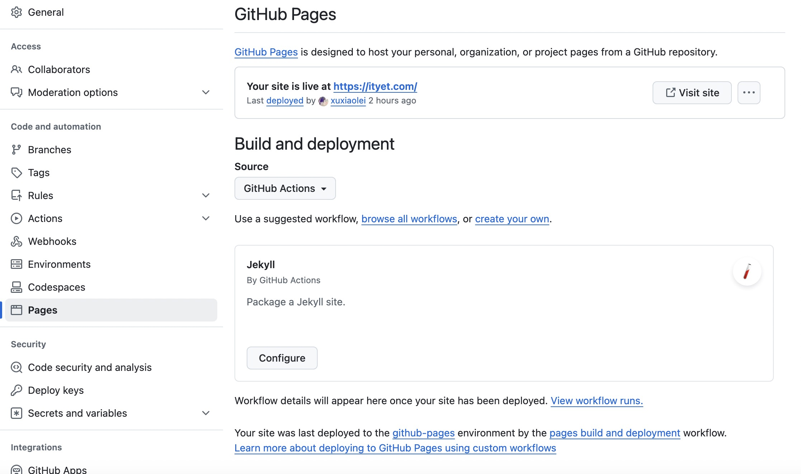

## 前言

静态网站，是指它所有内容都是静态的，即预先编写好并存储在服务器上，访问者获取到的是事先准备好的静态文件。

所以完全不需要购买服务器，除了域名之外，几乎不会有其他花销。

我在构建以上五个静态站点的过程中，积累了大量经验，本篇文章将总结这些经验，完整地介绍**如何用 Github Pages 免费部署网站**，并说明其中的**技术原理**。

## **Github 建仓库**

首先在 Github 上新建一个代码仓库，用于托管网页代码，仓库的命名规范为：

\<your-username>.github.io

以我的个人 github 账号 `feelang` 为例，仓库名称就是 `feelang.github.io`。

当然，无论是个人账号还是组织账号，都可以创建这种仓库。

## **使用静态网站生成器建站**

静态网站生成器是一种工具或框架，用于创建静态网站。

静态网站是由预先生成的 HTML、CSS 和 JavaScript 文件组成的网站，这些文件在部署之前就已经生成好，并且在用户访问时直接提供这些静态文件，而无需动态生成页面内容。

静态网站生成器的工作流程通常包括以下步骤：

1. 内容编写：使用文本编辑器或内容管理系统（CMS）编写网站的内容，例如使用 Markdown 或 HTML 编写文章、页面等。
2. 模板设计：定义网站的整体布局和样式，通常使用模板语言编写，以便在生成过程中将内容填充到相应位置。
3. 静态网站生成：运行静态网站生成器，它会读取内容和模板，并根据设定的规则和配置生成静态网站的文件。
4. 部署：将生成的静态文件上传至服务器或托管平台，使其可通过网址访问。

静态网站生成器具有一些优点，例如快速加载速度、安全性高、易于部署和扩展等。

它们适用于许多类型的网站，包括**博客**、**文档**、**公司介绍**和**产品展示**等。

通过使用静态网站生成器，开发人员和内容创作者可以更专注于网站的内容和设计，而无需处理动态网站的复杂性和服务器维护。

以下是几个常见的静态网站生成器及其特点：

| 静态网站生成器 | 描述                                                                                         |
| -------------- | -------------------------------------------------------------------------------------------- |
| Jekyll         | 使用 Ruby 编写的简单、灵活的静态网站生成器，支持 Markdown 和 Liquid 模板语言。               |
| Hugo           | 使用 Go 编写的快速、灵活的静态网站生成器，具有强大的主题和插件生态系统。                     |
| Gatsby         | 基于 React 的静态网站生成器，支持使用 GraphQL 查询数据，并具有出色的性能和开发人员体验。     |
| Hexo           | 快速、简单的静态博客生成器，使用 Node.js 编写，支持多种主题和插件。                          |
| VuePress       | 基于Vue.js 的静态网站生成器，专注于文档编写，支持 Markdown 和 Vue 组件。                     |
| Eleventy       | 简单灵活的静态网站生成器，支持多种模板语言，可使用 JavaScript、Markdown、HTML 等来编写内容。 |
| Pelican        | 使用 Python 编写的静态博客生成器，支持多种标记语言和插件扩展。                               |
| MkDocs         | 专注于文档生成的静态网站生成器，使用 Markdown 编写文档，支持主题和插件定制。                 |

这些静态网站生成器都具有各自的特点和优势，可以根据自己的需求和技术偏好选择适合的工具来构建静态网站。

本文就以比较老牌的 Jekyll 为例。如果对 Jekyll 不熟悉，可以参考我写的 Jekyll 中文教程，内容浅显易懂，一学就会。

我们第一步中新建的 Github 仓库 clone 到本地，打开终端，进入目录，执行如下命令：

jekyll create .

这行命令会创建一个空的 Jekyll 项目，所有配置都是默认值，暂时不用修改。

项目创建完成之后，执行：

bundle exec jekyll serve

命令执行成功以后，访问 `http://127.0.0.1:4000`，一个最原始的静态展点就完成了。

## **提交代码**

将上一步中 Jekyll 生成的全部代码提交至新建的 Github 仓库：

git add . git ci -am'first commit' git push

## **配置 Github Pages**

打开新建的 Github 仓库主页，选择 `Settings -> Pages`：

* 在 `Buld and deployment` 的 `Source` 下拉框中选择 `Github Actions`
* 网站会自动进入构建状态
* * 可以点击顶部菜单 `actions` 查看构建过程
    等待构建完成

## **测试网站**

构建成功之后，打开浏览器，输入域名 `xuxiaolei.github.io`，如果能正常打开，说明已经部署成功。

## **配置域名解析**

这里以阿里云为例，其他平台大同小异。

进入后台，打开控制台，找到云解析DNS / 域名解析。

添加两条解析规则：

| 主机记录 | 记录类型 | 解析请求来源 | 记录纸              | TTL    |
| -------- | -------- | ------------ | ------------------- | ------ |
| www      | CNAME    | 默认         | xuxiaolei.github.io | 10分钟 |
| @        | CNAME    | 默认         | xuxiaolei.github.io | 10分钟 |

回到 Github Pages，将 `ityet.com`（以本站为例）填入 `Custom domain`，勾选 `Enforce HTTPS`。

等待十分钟以后，浏览器输入 `ityet.com` 就可以直接打开网站了。

这次一个非常简单的静态站点就部署完成。

如果想要进一步修改网站内容，可以跟着 Jekyll 中文教程修改配置项。

---

**那么什么是 CNAME 呢？**

CNAME（Canonical Name）是域名系统（DNS）中的一种记录类型，用于将一个域名指向另一个域名。它通常用于创建别名或子域名，并将其映射到另一个域名或服务器上。CNAME记录允许你在不改变实际主机 IP 地址的情况下，**将一个域名映射到另一个域名上**。

具体来说，CNAME 记录是一种 DNS 记录，它将一个域名映射到另一个域名，使得当用户访问被 CNAME 指向的域名时，DNS会将请求转发到目标域名的服务器上。这对于需要将多个域名指向同一台服务器或实现域名的重定向非常有用。

我们通过创建 CNAME 记录，将别名 www.ityet.com 和 ityet.com 指向了 xuxiaolei.github.io ，这样当用户访问 ityet.com 时，DNS会将请求转发到 http://xuxiaolei.github.io 的服务器上，实现访问网站的效果。

总结起来，CNAME 记录是用于将一个域名指向另一个域名的DNS记录类型，它提供了域名映射和别名功能，方便管理和配置域名的指向。

